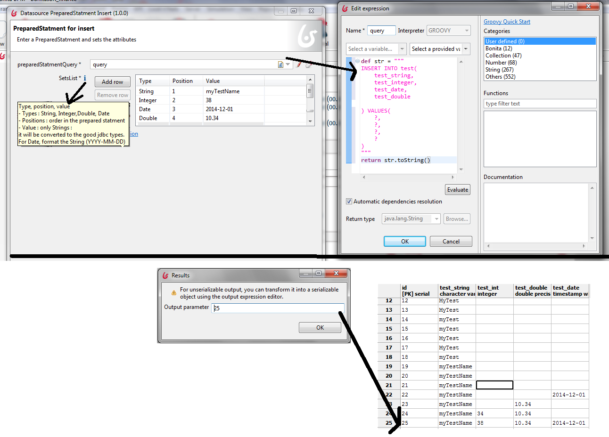

# bonitasoft-connector-datasource-preparedStatement-Insert

#Description : JDBC Datasource connector to Insert into a database with a prepared statement  

Author : Frederic KREBS

Bonita BPM version : 6.3.3

#Example works with:
* Postgresql 
* Bonita BPM 6.5.3

#Example installation
* Execute the sql script in your Posgresql database : script_db_postgresql.sql
* Deploy the process on your Bonita BPM 6.5.3 server : example_preparedStatementInsertConnector-01.00.00.bos
* Configure your datasource : 
** Edit the tomcat/conf/Catalina/localhost/bonita.xml
** Add a new datasource like the "Start for the PreparedStatement connector Example"  
* Set the datasource parameter in the process parameter configuration (working example: dbDatasourceName = tmpTest01DS)
* Run the process
* Fill and validate the Insert form
* View the resulting Id in the View activity

#Usage
* Add a process data to set the resultID after the insert statement : let's name it ID
* Import the connector in your studio : DatasourcePreparedStatementInsert-impl-1.0.1.zip
* Change the JNDI Name to access your datasource
* Edit the prepared statement
* Set the parameter list. For each :

* * add a Type (String, Integer,Double or Date)
* * add an order which will respect the prepared statement field order
* * add a value : WARNING : the value is only a String , it will be cast inside the connector: this is a conception choice !
For the Date type, format the String (YYYY-MM-DD)
* In the output operations, select your ID variable (which will take the generatedKey value) 

See the following screen shot to understand the connector configuration :

#FAQ
* I need more types. How to ?
Update the connector implementation
* I want to change the datasource : How to ?

** Edit your bonita.xml
** change your process configuration parameter